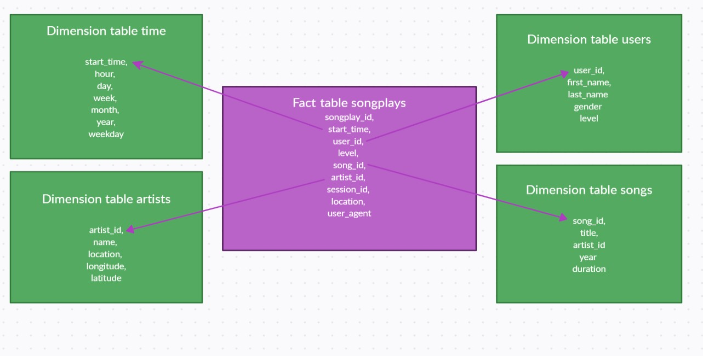

## Introduction

Sparkify has collected song and user data in json format. 
The existing json format does not allow for straightforward queries to find out which songs users are listening to.
Therefore, the task has been to create a database schema and ETL pipeline to help with this analysis.

## Database schema design and ETL process

The star schema consists of a fact table called songplays and four dimension tables: users, songs, artists and time.
The fact table songplays includes all of the primary keys of the dimension tables, that is the primary keys user_id, song_id, artist_id and start_time,
so the schema allows for a very flexible usage of JOIN SELECT statements.

## How to run the Python project
In order to run the project, please kindly run the following files:

create_tables.py

etl.py

